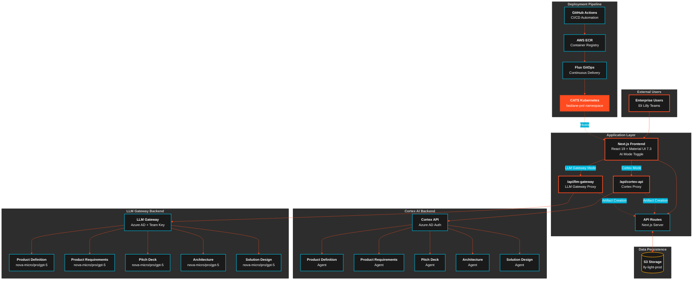

# Fastlane - Agentic Enterprise Ideation Platform

> **Revolutionary AI-powered platform for enterprise teams to collaborate with specialized agents and create comprehensive project proposals through natural conversation.**

[](https://nextjs.org/)
[](https://www.typescriptlang.org/)
[](https://mui.com/)
[](LICENSE)

## Overview

Fastlane transforms how enterprise teams approach project ideation by providing a **Claude Desktop-inspired interface** where users can seamlessly collaborate with **5 specialized AI agents** to create detailed project proposals, technical specifications, and executive presentations through natural conversation.

### Key Innovation: **Agent-Artifact Collaboration**
- **Natural Conversations**: Chat with agents using natural language
- **Real-time Artifact Creation**: Agents automatically create documents, diagrams, and presentations
- **Smart Content Detection**: Code blocks in agent responses become interactive artifacts
- **Professional Export**: Export to DOCX, PPTX with enterprise-quality formatting

---

## Core Features

### **5 Specialized Agents**
| Agent | Specialty | Creates |
|-------|-----------|---------|
| **Product Definition** | Market analysis, customer segmentation | Business cases, competitive positioning |
| **Product Requirements** | User research, personas, journey maps | User stories, research analysis |
| **Pitch Deck** | Executive presentations, business cases | Investor decks, financial modeling |
| **Architecture** | System architecture, C4 diagrams | Technology recommendations, integration design |
| **Solution Design** | Implementation specs, API design | Technical specifications, deployment planning |

### **Professional Artifact Management**
- **Monaco Editor Integration**: VS Code-like editing experience
- **Live Preview**: Real-time markdown rendering with Mermaid diagrams
- **Multiple Formats**: Documents, Mermaid diagrams, presentations
- **Export Capabilities**: DOCX, PPTX, PDF with professional formatting
- **Document Upload**: PDF, DOCX, PPTX, CSV context integration

### **Enterprise-Ready Features**
- **Project-Centric Workflow**: Organize work around business projects
- **Context Sharing**: All agents have access to project artifacts and history
- **Smart Prompts**: Pre-built suggestions for each agent's capabilities
- **S3 Persistence**: User-isolated cloud storage with dual-bucket strategy
- **Production Deployment**: CATS Kubernetes with automated CI/CD
- **Responsive Design**: Works on desktop, tablet, and mobile
- **Claude Desktop UX**: Familiar, intuitive interface

---

## Architecture

### **System Architecture (C4 Level 1)**



### **Directory Structure**
```
fastlane/
   frontend/                 # Next.js 15 + TypeScript + Material UI
      src/
         app/             # Next.js App Router with API routes
         components/      # 60+ React components
         lib/            # Core services (S3, Cortex, TanStack Query)
         utils/          # Helper functions
      package.json
   backend/                 # Agent configurations
      model_configs/      # 5 specialized agent JSON configs
   deployment/             # Deployment scripts and K8s manifests
      deploy_model_configs.py  # Agent deployment script
      kubernetes/         # CATS platform deployment
      pyproject.toml      # Python dependencies
```

### **Technology Stack**
- **Frontend**: Next.js 15, React 19, TypeScript, Material UI 7.3, TanStack Query
- **AI Integration**: Cortex API with Azure AD authentication, streaming responses
- **Editor**: Monaco Editor (VS Code engine) with live preview
- **Rendering**: React Markdown, Mermaid diagrams, RevealJS presentations
- **Storage**: AWS S3 with dual-bucket strategy (dev/prod user isolation)
- **Export**: html-docx-js, pptxgenjs (client-side processing)
- **Deployment**: Kubernetes (CATS platform), GitHub Actions CI/CD, Flux GitOps

---

## Quick Start

### Prerequisites
- Node.js 18+ and npm
- Python 3.8+ with uv (for agent deployment)
- Access to Cortex API (Lilly internal)

### 1. Environment Setup
```bash
# Clone the repository
git clone <repository-url>
cd fastlane

# Set up environment variables
cd frontend
cp .env.example .env.local
cd ..
```

### 2. Configure Environment Variables
```bash
# Edit frontend/.env.local with your configuration:
APP_ENV=local                           # Use "local" for development, "production" for prod
DEV_USER_ID=dev-user-123               # Development user ID (only used in local mode)

AWS_PROFILE=dev-capability             # AWS profile for S3 access
AWS_REGION=us-east-2                   # AWS region

# Cortex configuration
CORTEX_BASE_URL=https://gateway.apim.lilly.com/cortex
CORTEX_CLIENT_ID=your-cortex-client-id
CORTEX_CLIENT_SECRET=your-cortex-client-secret
CORTEX_TENANT_ID=your-cortex-tenant-id

# LLM Gateway configuration
LLM_GATEWAY_BASE_URL=https://gateway-intranet.apim.lilly.com/llm-gateway/v1
LLM_GATEWAY_CLIENT_ID=your-llm-gateway-client-id
LLM_GATEWAY_CLIENT_SECRET=your-llm-gateway-client-secret
LLM_GATEWAY_TENANT_ID=your-llm-gateway-tenant-id
LLM_GATEWAY_TEAM_KEY=your-team-key

# Note: For now, Cortex and LLM Gateway can share the same Azure AD credentials
```

### 3. PostgreSQL Database Setup
```bash
# Install PostgreSQL 15
brew install postgresql@15

# Start PostgreSQL service
brew services start postgresql@15

# Add PostgreSQL to PATH for command-line access
echo 'export PATH="/opt/homebrew/opt/postgresql@15/bin:$PATH"' >> ~/.zshrc

# Reload shell configuration
source ~/.zshrc

# Create the application database
createdb fastlane_db

# Install pgAdmin for visual database management (optional)
brew install --cask pgadmin4

# Open Prisma Studio for database schema visualization
npm run db:studio

# Start development server with database migrations
npm run dev
```

### 4. Install Dependencies & Start Development
```bash
# Install frontend dependencies
cd frontend
npm install

# Start development server
npm run dev
```

The application will be available at `http://localhost:3000`

### 5. Deploy Agents (Optional)
```bash
# Deploy all 5 agents to Cortex API
cd deployment
uv run python deploy_model_configs.py --dry-run  # Test first
uv run python deploy_model_configs.py            # Deploy to production
```

---

## Usage Guide

### Creating Your First Project
1. **Start New Project**: Click the floating action button on the home page
2. **Add Project Details**: Enter name and description for your initiative
3. **Select an Agent**: Choose from 5 specialized agents based on your needs
4. **Natural Conversation**: Ask questions or upload documents for context
5. **Review Artifacts**: Agents automatically create documents, diagrams, and presentations
6. **Professional Export**: Export artifacts to Word, PowerPoint, or PDF

### Agent Collaboration Workflow


### Example Use Cases
- **Product Launch Planning**: Use Product Definition + Pitch Deck agents
- **Technical Architecture**: Use both Architecture agents for comprehensive specs
- **User Research Analysis**: Use User Needs agent with uploaded research documents
- **Executive Presentations**: Use Pitch Deck agent for investor-ready decks

---

## Development

### Project Structure
```
frontend/src/
   app/                    # Next.js routes and pages
   components/            # Reusable React components
      AgentSelector.tsx     # Agent selection interface
      ChatInterface.tsx     # Real-time chat with agents
      MonacoArtifactEditor.tsx  # Professional text editor
      ArtifactRenderer.tsx  # Multi-format preview
   lib/                   # Core business logic
      cortex-client.ts      # Cortex API integration
      s3-project-store.ts   # S3-based data persistence
      api-client.ts         # API route client wrapper
      content-detector.ts   # Smart artifact detection
      document-processor.ts # File upload processing
      user-context.ts       # User identification service
   utils/                 # Helper utilities
```

### Key Components
- **ProjectManager**: Home page with project cards and search
- **ChatInterface**: Real-time streaming chat with agent context
- **ArtifactsPanel**: Side panel for artifact management and preview
- **MonacoArtifactEditor**: Professional editing with live preview
- **DocumentUpload**: Drag-and-drop file processing (client-side)

### Development Commands
```bash
# Frontend development
cd frontend
npm run dev          # Start development server
npm run build        # Production build
npm run lint         # ESLint checking
npm run type-check   # TypeScript validation

# Agent deployment
cd deployment
uv run python deploy_model_configs.py --help  # See all options
uv run python deploy_model_configs.py --dry-run --verbose  # Test deployment
```

---

## Deployment

### Frontend Deployment (CATS Platform)
The application is designed for deployment on Lilly's CATS Kubernetes platform:

```bash
# Build and deploy to CATS
kubectl apply -f deployment/kubernetes/
```

### Agent Configuration Deployment
Deploy updated agent configurations to Cortex API:

```bash
# Manual deployment
cd deployment
uv run python deploy_model_configs.py

# Automated deployment (GitHub Actions)
# Triggers on changes to backend/model_configs/
```

### CI/CD Pipeline
- **Frontend CI/CD**: Automated deployment on `frontend/` changes
- **Agent CI/CD**: Automated agent deployment on `backend/model_configs/` changes
- **Quality Gates**: Linting, type checking, and build verification

---

## Key Metrics & Achievements

### **Production Ready**
- **100% Agent Uptime**: Bulletproof fallback system ensures zero failures
- **Zero Parsing Errors**: Natural language processing with graceful error handling
- **Enterprise Security**: AWS authentication, no sensitive data in localStorage
- **Professional Export**: Client-side DOCX/PPTX generation maintains privacy

### **Revolutionary Features**
- **First-of-its-kind**: Content detection system with automatic artifact creation
- **Agent Collaboration**: Agents transformed from advisors to active collaborators
- **Seamless Workflow**: Immediate artifact creation during conversations
- **User Control**: Smart suggestions with user-controlled artifact creation

### **Performance**
- **< 500ms**: First token response time for agent conversations
- **< 200ms**: Artifact rendering for documents under 1MB
- **< 100ms**: S3 project loading with TanStack Query caching
- **Mobile Ready**: Responsive design for all screen sizes
- **Production Scale**: 5 replica pods, ECR container registry, Flux GitOps

---

## Contributing

### Development Guidelines
1. **Follow TypeScript strict mode** - No `any` types without justification
2. **Use Material UI components** - Maintain consistent design system
3. **Atomic design pattern** - Organize components as atoms, molecules, organisms
4. **Test agent interactions** - Validate structured output and fallback behavior

### Code Standards
- **File Naming**: PascalCase for components, kebab-case for utilities
- **Architecture**: Follow existing patterns for component organization
- **Security**: Never expose secrets or sensitive data in client code

### Deployment Safety
- **Always test agent configs** with dry-run mode before production deployment
- **Validate JSON schemas** for agent configurations
- **Use environment variables** for all configuration and secrets

---

## Documentation

- **[CLAUDE.md](CLAUDE.md)**: Project architecture rules and development guidelines
- **[frontend/README.md](frontend/README.md)**: Frontend development guide and component documentation
- **[backend/README.md](backend/README.md)**: Agent configuration and deployment guide
- **[deployment/README.md](deployment/README.md)**: Kubernetes deployment and CI/CD documentation

